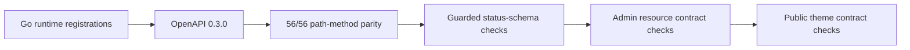
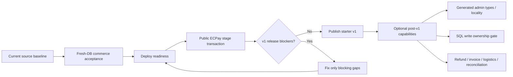

# Project status and v1 boundary

Last reviewed: 2026-09-03, against the `ecpay-official-conformance-hardening` revision-2 repository state based on `main@0071aebecf8b6939308e7965fb5f0a07797d8579`.

This document is the canonical high-level status for the starter. It separates source/runtime completion, contract truth, provider conformance, deployment acceptance, and optional commerce operations so the project does not grow into a full commerce framework by accident.

## Current position

| Area | Status | Meaning |
| --- | --- | --- |
| Starter architecture | Complete for v1 | Beginner single-site boundaries, explicit composition, fail-closed architecture checks, controlled changes, and CI gates are in place. |
| AI/spec governance | Complete for v1 foundation | `architecture.yaml`, `AGENTS.md`, `speccheck`, `archcheck`, evidence rules, PR verification, and evidence-complete lifecycle cleanup are operational. Genuinely blocked/pending evidence remains open rather than being falsely promoted. |
| Commerce sample | Runtime core flow complete | Product → cart → quote → checkout → durable order → payment → order lookup is implemented. |
| ECPay AIO credit | Source-level official conformance complete | Existing AIO credit integration has been audited against pinned official `ECPay/ECPay-API-Skill@ae964f75…`; callback `TradeAmt`, `SimulatePaid`, Go CMV apostrophe encoding, and HTTPS callback-port handling are aligned and independently replayed. Public provider reachability is still deployment acceptance. |
| HTTP/OpenAPI contract truth | Complete for current runtime surface | OpenAPI 0.3.0 represents all 56 registered Go operations. Symmetric route/method parity plus guarded observable status/schema checks run in `make verify-contracts`. |
| Deployment readiness | Partial | Provider wiring exists, but a production-shaped public deployment, fresh-DB walkthrough, rate-limit topology decision, and one public ECPay stage transaction are not yet accepted. |
| Full commerce operations | Intentionally incomplete | Refunds, invoices, logistics, reconciliation jobs, and production operations remain optional follow-up work. |

See [`review-status.md`](review-status.md) for historical review interpretation, [`commerce-acceptance.md`](commerce-acceptance.md) for the commerce/deployment boundary, and [`ecpay-official-conformance.md`](ecpay-official-conformance.md) for the pinned provider audit.

## What is complete

### Starter and governance

- Beginner-facing single-site architecture with a small default production shape.
- Static public site with Go rendering; no frontend SSR framework requirement.
- Separate Vue admin SPA and scoped Vue islands for the commerce theme.
- Explicit module/bootstrap ownership; no runtime DI container or plugin registry.
- SQLite local development and PostgreSQL production migration parity.
- Supabase Auth integration, R2 media boundary, and Resend email boundary.
- `architecture.yaml` import policy with fail-closed `archcheck`.
- Controlled specifications under `specs/changes/<change-id>/` with `speccheck` enforcement.
- Runtime/OpenAPI route and method parity for all 56 registered Go operations through `contracts/check-runtime-openapi.mjs`.
- Guarded observable contract checks for high-risk status/schema boundaries, with mutation evidence proving route omission and admin-product success-status drift fail the gate.
- Existing admin resource and public-theme OpenAPI contract checks remain part of `make verify-contracts`.
- Repository tests, live PostgreSQL integration tests, concurrency stress tests, and `go vet` are part of normal CI.
- Commerce cohesion refactor completed across models, service behavior, persistence, order flow, and tests.
- Evidence-complete lifecycle debt closed for `commerce-boolean-adapter-and-live-evidence`, `ephemeral-postgres-local-gate`, `harden-implementation-handoffs`, and `scoped-worktree-validation`.

### Commerce sample

- Published product/catalog flow.
- Cart add/remove/quantity/variant behavior.
- Cart persistence stores identity/selection/quantity rather than browser-authoritative prices.
- Cart rehydration reloads authoritative product data and fails closed on unavailable catalog data.
- Server-authoritative quote for subtotal, discount, shipping, and total.
- Admin-managed shipping methods and payment methods.
- Promotion validation.
- Guest checkout and authenticated member checkout.
- Stable create-order idempotency.
- Transactional stock decrement and durable order creation.
- Guest opaque order access credential and authenticated member order history.
- Admin order/status management.
- Return request workflow and per-item restock ledger/workflow.

### ECPay AIO credit

The sample reaches a hosted-payment boundary rather than stopping at a mock checkout.

```mermaid
flowchart TD
    A[Product] --> B[Cart]
    B --> C[Server quote]
    C --> D[Create durable order]
    D --> E[Order: unpaid]
    E --> F[Server prepares ECPay AIO form]
    F --> G[TotalAmount + CheckMacValue]
    G --> H[Browser POST to ECPay]
    H --> I[ECPay payment page]
    I --> J[Server-to-server ReturnURL]
    I --> K[Browser return]
    J --> L[Verify CMV / MerchantID / trade identity / TradeAmt]
    L --> M{Simulation or non-success?}
    M -->|yes| N[ACK 1|OK; no success claim/state mutation]
    M -->|no, real RtnCode=1| O[Durable one-effect claim]
    O --> P[payment_status = paid + order event]
    P --> Q[Return exact 1|OK]
    K --> R[Storefront restores same-tab order credential]
    R --> S[Re-query server order]
    S --> T{payment_status == paid?}
    T -->|yes| U[Clear cart and confirm]
    T -->|not yet| V[Retry briefly / show confirming state]
```

Current safety properties:

- HashKey/HashIV remain server-only.
- AIO stage/production endpoint selection is finite and validated.
- Known public ECPay test credentials are rejected in production mode.
- Browser navigation cannot mark an order paid.
- Create-order request uses durable `TotalAmount`; provider callback reconciliation uses official `TradeAmt`.
- `ReturnURL` verifies CheckMacValue, MerchantID, merchant trade identity, and durable amount before financial authority is considered.
- `SimulatePaid=1` and signed non-success/pending callbacks do not consume the durable success claim.
- A later valid real success can still capture exactly once; conflicting claimed success callbacks remain fail-closed through the existing durable claim/CAS boundary.
- Callback claim, paid transition, order version update, and payment-status event remain atomic.
- Browser return is navigation only and re-queries durable server state.
- Go CheckMacValue matches pinned official baseline/apostrophe/tilde/space/callback SHA256 vectors.
- HTTPS callback origins accept implicit 443 or explicit `:443` and reject non-standard HTTPS ports; starter policy also rejects direct IP and unencoded Unicode hosts.

The original ECPay runtime flow was merged and full-CI verified under PR #8. The later official-conformance hardening is supported by pinned official-source review and revision-2 independent protocol replay. During the 2026-09-01 to 2026-09-03 review window GitHub did not produce pull-request Actions runs for PR #15/#16, so this document does not claim those PR runs were green; merge-triggered `main` CI remains the repository regression check for that hardening.

## HTTP contract truth restoration

`restore-http-contract-truth` revision 2 is Accepted and merged. `contracts/openapi.yaml` describes the current registered Go HTTP surface rather than a desired future shape.



This restoration deliberately did **not** normalize all response envelopes or adopt generated TypeScript types. Resource-specific envelopes remain acceptable when consumers use explicit contracts. Generated admin types and `ResourceListPage.vue` decomposition are post-contract locality improvements, not v1 deploy blockers.

## Official ECPay conformance audit

The source-level provider audit is complete against pinned official commit `ae964f75b69ec90e1c205b136364ab6587fc328c`.

Verified/fixed findings:

- ReturnURL amount is `TradeAmt`, not request-side `TotalAmount`.
- Go CMV includes apostrophe `' -> %27` in addition to the existing ECPay URL-encoding rules.
- `SimulatePaid=1` cannot mark an order paid.
- Signed non-success/pending callbacks do not consume the one-time real-success claim.
- implicit 443 and explicit `:443` are valid HTTPS origins; non-443 HTTPS ports fail closed.
- `ItemName` uses the current recommended 200-character operating boundary.
- OpenAPI callback schema and its mechanical guard use `TradeAmt` plus optional `SimulatePaid`.

See [`ecpay-official-conformance.md`](ecpay-official-conformance.md) and `specs/changes/ecpay-official-conformance-hardening/receipts/` for the pinned source and replay evidence.

## What remains before calling v1 deploy-ready

These are release-readiness tasks, not missing architecture foundations.

1. **Sample commerce acceptance review**
   - Fresh database and deterministic sample data.
   - Browse product → add cart → reload/rehydrate → quote → guest/member order → payment handoff → order lookup → admin lookup → return/restock.
   - External provider reachability remains deploy acceptance when no public environment exists yet.

2. **Deploy readiness**
   - Railway Go API + PostgreSQL.
   - Cloudflare Pages site build/publish.
   - Supabase Auth production configuration.
   - R2 and Resend production configuration.
   - Public HTTPS ECPay ReturnURL/OrderResultURL.
   - Migration/pre-deploy behavior and smoke tests.
   - Decide public rate-limit enforcement from the real deployment topology and trusted client-IP source; do not assume an in-memory single-process limiter is globally correct.

3. **One ECPay stage transaction before production**
   - Required as go-live/deployment acceptance, not as a source-code completion gate.
   - Verify hosted checkout, external ReturnURL reachability, exact `1|OK`, durable `paid`, and browser re-query on the deployed environment.

## Explicitly open but not automatic v1 blockers

- `postgres-lock-semantics-and-evidence` — remaining independent/CI evidence should be reconciled when that verification is replayed.
- `verify-contract-checks` — this older lifecycle still has pending evidence and should be reconciled independently; it does not negate the newer Accepted `restore-http-contract-truth` parity gate.
- `supabase-jwks-verifier` — live Supabase compatibility/rollback evidence is environment-blocked. The remote verifier remains a correctness-preserving fallback unless an auth-path SLA makes JWKS mandatory.
- `minimal-cart-integration` — historical umbrella with remaining deployment/provider/policy acceptance; later accepted slices do not justify falsely marking unresolved umbrella evidence passed.

Old Drafts such as `commerce-module-file-split` and `public-endpoint-rate-limit` must be re-proposed from the current baseline before implementation; their old plans are not current authority.

## Intentionally not required for starter v1

- ECPay refund/cancel integration.
- Refund authorization/AAL2 and refund idempotency.
- Payment reconciliation/query jobs and operational dashboards.
- ECPay electronic invoice integration.
- ECPay logistics or another shipping provider integration.
- Shipment/tracking webhook lifecycle.
- Failed-payment recovery automation and abandoned-payment policy.
- Admin refund UX.

Adding these should be driven by a concrete product outcome. They should not be added merely to make the starter resemble a full commerce platform.

## v1 release boundary



The intended decision rule is simple: **publish once the repository contract is trustworthy, the starter is deployable, and the reference commerce flow is acceptance-tested; do not wait for every commerce operation or optimization to exist.**

## Maintenance rule

Update this document when a change materially alters one of these states. Do not mark a capability complete because a helper, route, component, spec, or focused checker exists; completion requires the real entry point plus the relevant contract/runtime verification or deployment receipt.
