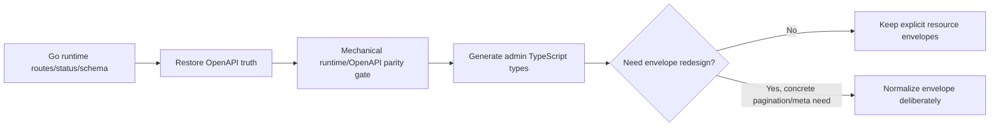

# Architecture review status overlay

Last reviewed against `main@08624e275a107ccca1621806d6e474c593ccc2d5` on 2026-08-31.

This file is the current interpretation layer for the historical architecture assessments in `docs/backend-optimization.md` and `docs/admin-architecture-review.md`. Those reports remain useful audit material, but their original priority tables are **not** the current backlog. When a historical statement conflicts with an Accepted controlled change or `docs/project-status.md`, the newer controlled state wins.

## Review conclusions after repository verification

### 1. Governance backlog: cleanup is real, but not an `apply` ambiguity by itself

Plain `apply` requires one current review-ready proposal. A `Verifying` change is not itself a review-ready proposal, so a large Verifying set does not automatically make `apply` select the wrong change. The real cost is lifecycle/context debt: stale baselines and old evidence remain visible to later agents and make repository state harder to reason about.

This review sequence closed four evidence-complete changes that had no remaining pending/blocked REQ or AC:

| Change | Previous state | Current state | Why |
| --- | --- | --- | --- |
| `commerce-boolean-adapter-and-live-evidence` | Verifying | Accepted | All declared evidence and required receipts were already passed. |
| `ephemeral-postgres-local-gate` | Verifying | Accepted | All declared evidence and required receipts were already passed. |
| `harden-implementation-handoffs` | Verifying | Accepted | All declared evidence and required receipts were already passed. |
| `scoped-worktree-validation` | Verifying | Accepted | All declared evidence and independent-review receipts were already passed; it was closed separately to avoid overlapping ownership of the prior README review diff. |

The following must **not** be mass-promoted merely for hygiene:

| Change | Keep open because |
| --- | --- |
| `postgres-lock-semantics-and-evidence` | Some acceptance evidence still requires independent review / observed CI identity. |
| `verify-contract-checks` | Independent mutation/version-floor acceptance evidence remains pending. |
| `supabase-jwks-verifier` | Live Supabase compatibility/rollback evidence is environment-blocked. |
| `minimal-cart-integration` | The umbrella change still contains deployment/provider/policy acceptance gaps even though many later slices are complete. |

`commerce-module-file-split` and `public-endpoint-rate-limit` are old Drafts from earlier baselines. Do not execute them directly as current plans. Re-propose from current repository reality if/when their outcome becomes a priority.

### 2. Historical review documents need a resolution overlay, not deletion

Several findings in the old backend review have already been resolved by later Accepted changes:

| Historical finding | Current state |
| --- | --- |
| Production admin API base/topology client configuration | Resolved by `admin-configurable-api-base` (Accepted). |
| PostgreSQL connection-pool configuration | Resolved by `postgres-connection-pool-configuration` (Accepted). |
| Request/status/client-IP observability | Resolved by `structured-request-observability` (Accepted). |
| Real PostgreSQL execution in repository CI | The current CI runs PostgreSQL migrations, live integration tests, and concurrency stress; do not treat the old “SQLite-only CI” finding as current. |

Keep the historical reports for reasoning and provenance, but use this overlay plus controlled changes to determine whether a finding is current.

`INTEGRATION_PLAN.md` is still referenced by the large `minimal-cart-integration` history and some source comments. Archive it only after those references are moved to current normative documents and the umbrella lifecycle is intentionally closed; do not delete it just to reduce token count.

### 3. HTTP/OpenAPI contract truth is the most important current technical gap

The contract problem is not merely response-envelope style. Runtime and `contracts/openapi.yaml` currently disagree on observable API behavior.

Verified examples include:

- Admin product create returns HTTP `201` in Go while the OpenAPI entry declares `200`.
- Admin product delete returns HTTP `200` plus `{ "id": ... }` in Go while OpenAPI declares `204` with no body.
- Admin product handlers return an admin-specific DTO while some OpenAPI operations still reference the public `Product` schema.
- The earlier admin review identified 11 registered admin routes missing from OpenAPI.
- ECPay later added three registered routes (`/api/orders/{id}/payments/ecpay`, `/api/payments/ecpay/return`, `/api/payments/ecpay/browser-return`) that are also outside the current OpenAPI contract, making the known missing-route set at least 14 at this review point.

The repository now has one review-ready proposal for this exact outcome: `specs/changes/restore-http-contract-truth/`. It deliberately stops before response-envelope redesign or generated TypeScript adoption.

The correct sequence is:

Do **not** combine these into one broad rewrite. First restore contract truth without changing runtime semantics. Only then generate types. A universal response envelope is optional; the unacceptable behavior is a consumer guessing with `Object.values(data).find(Array.isArray)` rather than consuming an explicit typed contract.

### 4. Admin locality should be improved before another broad commerce split

`admin/src/pages/ResourceListPage.vue` remains a large cross-resource component with many `Record<string, any>` boundaries. After OpenAPI truth is restored, generated types and explicit response access should come before splitting the component into cohesive data/form/action/restock seams.

Commerce still has large internal files, but it has already gone through several cohesion slices. If further splitting is needed, re-inventory the **current** files and preserve the existing `commerce` top-level module. Do not apply the stale `commerce-module-file-split` Draft verbatim and do not create new top-level modules just to reduce file size.

### 5. SQL ownership deserves a mechanical guard, after ownership metadata is current

`archcheck` currently enforces Go import boundaries, not SQL table-write ownership. This review first refreshed `architecture.yaml` so commerce owns `ecpay_payment_attempts` and the known commerce-to-media write points at `store_catalog.go:markMediaAssociationsTx` rather than stale line numbers.

A later low-cost guard should scan module SQL writes (`INSERT INTO`, `UPDATE`, `DELETE FROM`) against `architecture.yaml` ownership plus explicit exceptions. Start with writes only; cross-module reads do not need the same correctness barrier. Do not add a heuristic scanner against stale ownership metadata.

### 6. Deploy-readiness interpretation

- **Rate limiting:** a real pre-production decision, but the existing Draft correctly depends on replica topology, trusted client-IP source, enforcement owner, and operating cost. Do not silently install an in-memory limiter and call the problem solved.
- **JWKS:** desirable for auth hot-path latency and external dependency reduction, but the current remote verifier can remain a correctness-preserving v1 fallback. Live JWKS acceptance should not block v1 unless the product establishes an SLA that requires it.
- **ECPay stage transaction:** deployment/go-live acceptance, not a source-code completion gate. Official protocol conformance review should happen before the stage transaction.

## Revised priority order

1. **HTTP contract truth restoration** — apply `restore-http-contract-truth`: Go routes/methods/status/schema ↔ OpenAPI, including ECPay; strengthen parity checks.
2. **Deploy readiness** — official ECPay audit, fresh-DB commerce acceptance, provider/env wiring, rate-limit topology decision, one stage transaction.
3. **Admin contract/locality** — generated OpenAPI types, explicit response access, then split `ResourceListPage.vue` along cohesive seams.
4. **Data-ownership enforcement** — add SQL-write ownership scanning after the refreshed ownership map proves stable.
5. **Residual cohesion/performance** — current-baseline commerce splitting, pagination/N+1/index work only when concrete scale or maintenance pressure justifies it.

The architectural decision remains unchanged: beginner single-site, static public output, one Go backend, explicit module ownership, no runtime DI/plugin registry, and no speculative platformization.
